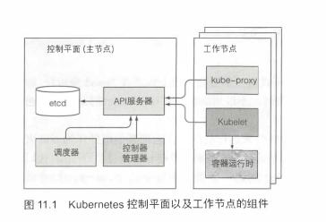
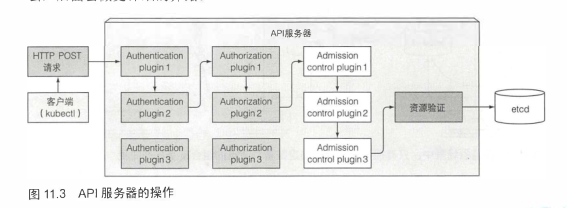
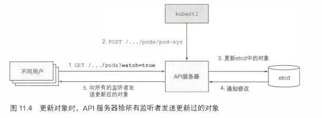
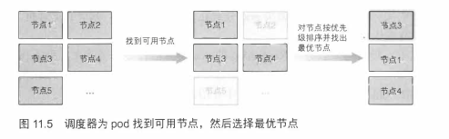
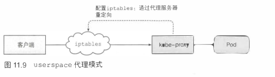
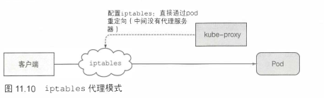

# k8s原理

## 1.了解架构

k8s集群分为两部分：控制平面，工作节点

**控制平面组件**：用来存储管理集群状态

- etcd：分布式持久化存储
- api服务器
- 调度器
- 控制器存储器

**工作节点组件**：运行容器的依赖

- kubelet
- kubelet服务代理（kube-proxy）
- 容器运行时（Docker、rkt、其他）

**附加组件**

- k8s dns服务器
- 仪表盘
- Ingress控制器
- Heapster(容器集群监控)
- 容器网络接口插件

架构图：



### 1.1k8s如何工作

组件间通信通过api服务器


> 组件如何运行？

控制平面组件和kube-proxy直接部署在系统或者以pod运行

kubalet 是唯一一个一直作为系统组件来运行的组件，它把其他组件作为pod来运行。为了将控制平面作为pod来运行，Kubelet被部署在master 上

> k8s使用etcd

etcd是一个分布式、响应快、一致的key-value存储。

唯一和etcd通信的是api服务器，其他组件通过api间接读取写入数据。

etcd 是Kubemetes存储集群状态和元数据的唯一的地方。

Kubemetes存储 所有数据到etcd的/registry下，一个目录对应一个namespace,pod按namespace存储。

etcd 使用 RAFT 一 致性算法来保证etcd集群的一致性。

etcd实例一般是基数。

> api服务器如何做什么?

Kubemet es API服务器作为中心组件， 其他组件或者客户端（如kubectl)都会去调用它。以RESTfulAPI的形式提供了可以查询、修改集群状态的CRUD接口。 它将状态存储到etcd中。对对象存储进行校验，处理乐观锁。



- 通过认证插件认证客户端

- 通过授权插件授权客户端

- 通过准入控制插件验证AND/OR修改资源请求

- 验证资源以及持久化存储

**api服务器如何通知客户端资源变更**



kubectl也可以监听

```bash
 kubectl get pods --watch
```

> 调度器如何调度？

​    利用 API 服务器的监听机制等待新创建的 pod, 然后给每个新的、 没有节点集的 pod 分配节点。

   调度器不会命令选中的节点（或者节点上运行的 Kubelet) 去运行 pod。

   调度器做的就是通过 API 服务器更新 pod的定义。 然后 API 服务器再去通知 Kubelet该 pod 已经被调度过。 当目标节点上的 Kubelet 发现该pod被调度到本节点， 它就会创建并且运行 pod的容器。

**默认的调度算法**

- 过滤节点，找到能分配的节点
- 对可用节点按优先级分配，找出最有节点，如果都高优先级，循环平均分配



> 控制器管理器中运行的控制器

控制器包括：

• Replication 管理器 (ReplicationController 资源的管理器）
• ReplicaSet 、 DaemonSet 以及 Job 控制器
• Deployment 控制器
• StatefulSet 控制器
• Node 控制器
• Service 控制器
• Endpoints 控制器
• Namespace 控制器
• PersistentVolume 控制器
• 其他

 	控制器做了许多不同的事情， 但是它们都通过 API 服务器监听资源（部署、 服务等）变更， 并且不论是创建新对象还是更新、 删除已有对象， 都对变更执行相应操作。 大多数情况下，这些操作涵盖了新建其他资源或者更新监听的资源本身（例如，更新对象的 sta 七 us) 。

ps ：未完待续

> kubelet做了什么

负责所有运行在工作节点上内容的组件。

- 在api服务器创建Node资源来注册节点

- 持续监控api服务器是否把节点分配给pod,然后启动pod容器

- 随后持续监控运行的状态，向api服务器报告状态、事件、资源消耗。

- kubelet也是运行容器存活探针的组件，当探针报错，他会重启容器

- 当pod从api服务器中删除时，kubelet会终止容器并告诉服务器容器已终止。


> kubeproxy作用

确保客户通能够通过api服务器到达最终的服务

确保对服务ip和端口的连接能够到达支持服务的某个pod(多个pod,起到负载均衡的作用)

**两种代理模式**

userspace模式



iptables代理模式



两种模式的主要区别是：

​	数据包是否会传递给kube-proxy, 是否必须在用户空间处理，或者数据包只会在内核处理（内核空间）。 这对性能有巨大的影响。

​	user space代理模式以轮询模式对连接做负载均衡，
而ip七ables代理模式不会， 它随机选择pod

> k8s插件

不是必要的

这些插件有用于启用Kubemetes服务的DNS查询， 通过单个外部IP地址暴露多个HTTP服、Kubemetes web仪表板等特性。

**DNS服务器***

**Ingress控制器**