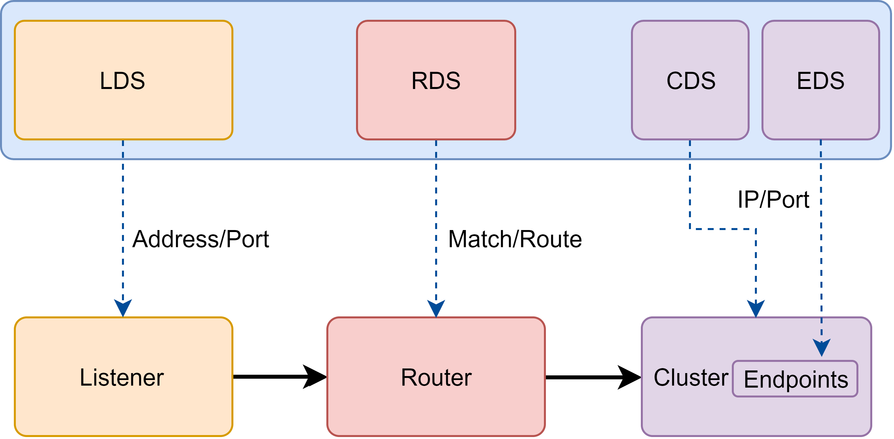

## envoy 的xDS-api

### 什么是xDS

> 详细介绍：[xDS](https://www.servicemesher.com/istio-handbook/ecosystem/xds.html)

xDS 是一发现服务的总称，包含LDS，RDS，CDS，EDS以及SDS。Envoy 通过xDS API 可以动态获取Listener(监听器)，Route(路由)，Cluster(集群)，Endpoint(集群成员)以及Secret(秘钥)配置。

- LDS

  LDS是Listener发现服务。Listener监听器控制Envoy启动端口监听（目前只支持TCP协议），并配L3/L4层过滤器，当网络连接达到后，配置好的网络过滤器堆栈开始处理后续事件。这种通过监听器体系结构用于执行大多数不同的代理任务(限流，客户端认证，HTTP连接管理，TCP代理等)。

- RDS

  Route发现服务，用于HTTP连接管理过滤器动态获取路由配置路由配置包含HTTP头部修改（增加、删除HTTP头部键值），virtual hosts （虚拟机），以及virtual hosts定义的各个路由条目。

- CDS

  Cluster发现服务，用于动态获取Cluster信息。Envoy cluster管理器管理着所有的上游cluster。鉴于上游Cluster或者主机可用于任何代理转发任务，所有上游Cluster一般从Listener或者Route中抽象出来。

- EDS

  Endpoint发现服务。在Envoy 术语中，Cluster成员就叫Endpoint，对于每个CLuster，Envoy通过EDS API动态获取Endpoint。EDS作为首选服务发现的原因有两点：

  - 于通过DNS解析的负载均衡器进行路由相比，Envoy能明确的知道每个上游主机的信息，因而可以做出更加智能的负载均策略。
  - Endpoint配置包含负载均衡权重、可用域等附加主机属性，这些属性可用于服务网格负载均衡，统计收集等过程中。

- SDS

  Secret发现服务，用于运行时动态获取TLS证书。ruo没有SDS特性，在k8s环境中必须创建包含证书的Secret，代理启动前Secret必须挂载到sidecar容器中，如果证书过期，则需要重新部署。使用SDS，集中式的SDS服务器将证书分发给所有的Envoy实例，如果证书过期，服务器会将新证书分发，Envoy接收到新的证书后重新加载儿不用重新部署。SDS基于k8swatch（订阅）获取Secret

