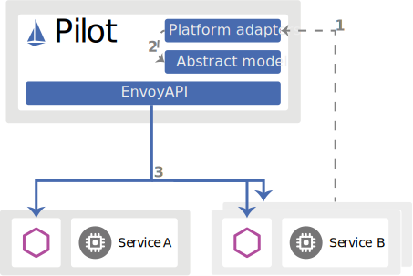

# istio

# 1.istio简介

Istio 提供一种简单的方式来为已部署的服务建立网络，该网络具有负载均衡、服务间认证、监控等功能，而不需要对服务的代码做任何改动。

- istio 适用于容器或虚拟机环境（特别是 k8s），兼容异构架构。

- istio 使用 sidecar（边车模式）代理服务的网络，不需要对业务代码本身做任何的改动。

- HTTP、gRPC、WebSocket 和 TCP 流量的自动负载均衡。

- istio 通过丰富的路由规则、重试、故障转移和故障注入，可以对流量行为进行细粒度控制；支持访问控制、速率限制和配额。

- istio 对出入集群入口和出口中所有流量的自动度量指标、日志记录和跟踪。
- 在具有强大的基于身份验证和授权的集群中实现安全的服务间通信。

## 1.1核心特性

istio以统一的方式提供了许多跨服务网络的关键功能：

### 1.流量管理

​	Istio 简单的规则配置和流量路由允许您控制服务之间的流量和 API 调用过程。

​	Istio 简化了服务级属性（如熔断器、超时和重试）的配置，并且让它轻而易举的执行重要的任务（如 A/B 测试、金丝雀发布和按流量百分比划分的分阶段发布）。

### 2.安全

Istio 提供了底层的安全通信通道，并为大规模的服务通信管理认证、授权和加密。

开发人员只需要关注程序的安全性

### 3.可观察性

Istio 健壮的追踪、监控和日志特性让您能够深入的了解服务网格部署。

通过 Istio 的监控能力，可以真正的了解到服务的性能是如何影响上游和下游的；

定制 Dashboard 提供了对所有服务性能的可视化能力

Istio 的 Mixer 组件负责策略控制和遥测数据收集。它提供了后端抽象和中介，将一部分 Istio 与后端的基础设施实现细节隔离开来，并为运维人员提供了对网格与后端基础实施之间交互的细粒度控制。

### 4.平台支持

独立于平台，被设计为可以在各种环境中运行，包括跨云、内部环境、Kubernetes、Mesos 等等。您可以在 Kubernetes 或是装有 Consul 的 Nomad 环境上部署 Istio。

目前支持：

- Kubernetes 上的服务部署
- 基于 Consul 的服务注册
- 服务运行在独立的虚拟机上

### 5.整合和定制

Istio 的策略实施组件可以扩展和定制，与现有的 ACL、日志、监控、配额、审查等解决方案集成。

## 1.2istio组件

stio由以下组件组成：

- **Envoy** - 每微服务器的Sidecar代理，处理集群中的服务间和服务到外部服务的入口/出口流量。代理形成安全的微服务网格，提供丰富的功能，如服务发现，丰富的7层路由，熔断器，策略执行和遥测记录/报告功能。

> 注意：服务网格不是overlay网络。它简化和增强了应用程序中的微服务通过底层平台提供的网络彼此通话的方式。

- **Mixer** - 由代理和微服务使用的集中式组件，用于执行策略，如鉴权，限流，配额，认证，请求跟踪和遥测收集等。
- **Pilot** - 负责在运行时配置代理的组件。
- **Citadel** - 负责证书颁发和轮换的集中式组件
- **Node Agent** - 负责证书颁发和轮换的每节点组件
- **Galley** - 用于在Istio中验证，摄取，聚合，转换和分发配置的中央组件。

Istio目前只支持Kubernetes平台和基于consul的环境，我们计划在不久的将来支持其他平台，如Cloud Foundry和Mesos。


### Envoy

Istio 使用 [Envoy](https://envoyproxy.github.io/envoy/) 代理的扩展版本。Envoy 是用 C++ 开发的高性能代理，用于协调服务网格中所有服务的入站和出站流量。Envoy 代理是唯一与数据平面流量交互的 Istio 组件。

Envoy 代理被部署为服务的 sidecar，在逻辑上为服务增加了 Envoy 的许多内置特性，例如:

- 动态服务发现
- 负载均衡
- TLS 终端
- HTTP/2 与 gRPC 代理
- 熔断器
- 健康检查
- 基于百分比流量分割的分阶段发布
- 故障注入
- 丰富的指标

这种 sidecar 部署允许 Istio 提取大量关于流量行为的信号作为[属性](https://istio.io/latest/zh/docs/reference/config/policy-and-telemetry/mixer-overview/#attributes)。Istio 可以使用这些属性来实施策略决策，并将其发送到监视系统以提供有关整个网格行为的信息。

sidecar 代理模型还允许您向现有的部署添加 Istio 功能，而不需要重新设计架构或重写代码。您可以在[设计目标](https://istio.io/latest/zh/docs/ops/deployment/architecture/#design-goals)中读到更多关于为什么我们选择这种方法的信息。

由 Envoy 代理启用的一些 Istio 的功能和任务包括:

- 流量控制功能：通过丰富的 HTTP、gRPC、WebSocket 和 TCP 流量路由规则来执行细粒度的流量控制。
- 网络弹性特性：重试设置、故障转移、熔断器和故障注入。
- 安全性和身份验证特性：执行安全性策略以及通过配置 API 定义的访问控制和速率限制。
- 基于 WebAssembly 的可插拔扩展模型，允许通过自定义策略实施和生成网格流量的遥测。

### Pilot

Pilot 为 Envoy sidecar 提供服务发现、用于智能路由的流量管理功能（例如，A/B 测试、金丝雀发布等）以及弹性功能（超时、重试、熔断器等）。

Pilot 将控制流量行为的高级路由规则转换为特定于环境的配置，并在运行时将它们传播到 sidecar。Pilot 将特定于平台的服务发现机制抽象出来，并将它们合成为任何符合 [Envoy API](https://www.envoyproxy.io/docs/envoy/latest/api/api) 的 sidecar 都可以使用的标准格式。

下图展示了平台适配器和 Envoy 代理如何交互。

[](https://istio.io/latest/zh/docs/ops/deployment/architecture/discovery.svg)

Service discovery

1. 平台启动一个服务的新实例，该实例通知其平台适配器。
2. 平台适配器使用 Pilot 抽象模型注册实例。
3. **Pilot** 将流量规则和配置派发给 Envoy 代理，来传达此次更改。

这种松耦合允许 Istio 在 Kubernetes、Consul 或 Nomad 等多种环境中运行，同时维护相同的 operator 接口来进行流量管理。

您可以使用 Istio 的[流量管理 API](https://istio.io/latest/zh/docs/concepts/traffic-management/#introducing-Istio-traffic-management) 来指示 Pilot 优化 Envoy 配置，以便对服务网格中的流量进行更细粒度地控制。

### Citadel

[Citadel](https://istio.io/latest/zh/docs/concepts/security/) 通过内置的身份和证书管理，可以支持强大的服务到服务以及最终用户的身份验证。您可以使用 Citadel 来升级服务网格中的未加密流量。使用 Citadel，operator 可以执行基于服务身份的策略，而不是相对不稳定的 3 层或 4 层网络标识。从 0.5 版开始，您可以使用 [Istio 的授权特性](https://istio.io/latest/zh/docs/concepts/security/#authorization)来控制谁可以访问您的服务。

### Galley

Galley 是 Istio 的配置验证、提取、处理和分发组件。它负责将其余的 Istio 组件与从底层平台（例如 Kubernetes）获取用户配置的细节隔离开来。

## 1.3资源CRD 

### **Istio Network CRD**

networking.istio.io

| CRD               | 描述                                                         |
| :---------------- | :----------------------------------------------------------- |
| VirtualService    | VirtualService 定义了一系列针对指定服务的流量路由规则。每个路由规则都针对特定协议的匹配规则。如果流量符合这些特征，就会根据规则发送到服务注册表中的目标服务（或者目标服务的子集或版本）。 |
| DestinationRule   | `DestinationRule` 所定义的策略，决定了经过路由处理之后的流量的访问策略。这些策略中可以定义负载均衡配置、连接池尺寸以及外部检测（用于在负载均衡池中对不健康主机进行识别和驱逐）配置。 |
| Gateway           | `Gateway` 描述了一个负载均衡器，用于承载网格边缘的进入和发出连接。这一规范中描述了一系列开放端口，以及这些端口所使用的协议、负载均衡的 SNI 配置等内容。 |
| ServiceEntry      | `ServiceEntry` 能够在 Istio 内部的服务注册表中加入额外的条目，从而让网格中自动发现的服务能够访问和路由到这些手工加入的服务。 |
| EnvoyFilter       | EnvoyFilter 对象描述了针对代理服务的过滤器，这些过滤器可以定制由 Istio Pilot 生成的代理配置。 |
| ServiceDependency | `ServiceDependency`描述工作负载依赖的服务集合。默认情况下，Istio建立的服务网格将具有完整的网格连接 - 即每个工作负载都拥有访问网格中的每个其他工作负载的代理配置。但是，大多数连接图在实践中都很稀疏。ServiceDependency提供了一种的方法来声明与每个工作负载关联的服务依赖关系，以便发送到sidecars的配置数量可以限定为必要的依赖。 |


### Istio Authentication CRD

authentication.istio.io

相关资料：

- 官方资料的配置参考： https://preliminary.istio.io/docs/reference/config/istio.authentication.v1alpha1/#Policy
- 代码在 `istio/api` 仓库下的 `authentication/v1alpha1` 目录

#### Policy

策略定义在工作负载上可以接受的身份验证方法，如果验证通过，哪个方法/证书将设置为请求主体(request principal)（即 `request.auth.principal` 属性）。

验证策略由两部分验证组成：

- peer：验证调用者服务证书。这部分将设置 `source.user`（peer identity）。
- origin：验证原始证书。此部分将设置 `request.auth.user`（origin identity），以及`request.auth.presenter`，`request.auth.audiences`和 raw claim 等其他属性。

请注意，身份可以是最终用户(end-user)，服务帐户(service account)，设备(device)等。

最后但并非最不重要的是，主要绑定规则(principal binding rule)定义应将哪个身份（peer 或者 origin）用作主体。默认情况下，使用peer。

#### Mesh Policy

TBD：没有找到介绍资料

`pilot/pkg/config/kube/crd/types.go` 中定义如下：

```go
// MeshPolicy is the generic Kubernetes API object wrapper
type MeshPolicy struct {
	meta_v1.TypeMeta   `json:",inline"`
	meta_v1.ObjectMeta `json:"metadata"`
	Spec               map[string]interface{} `json:"spec"`
}
```

`install/kubernetes/helm/istio/templates/crds.yaml`:

```yam
kind: CustomResourceDefinition
apiVersion: apiextensions.k8s.io/v1beta1
metadata:
  name: meshpolicies.authentication.istio.io
  annotations:
    "helm.sh/hook": crd-install
  labels:
    app: istio-citadel
    chart: istio
    heritage: Tiller
    release: istio
spec:
  group: authentication.istio.io
  names:
    kind: MeshPolicy
    listKind: MeshPolicyList
    plural: meshpolicies
    singular: meshpolicy
    categories:
    - istio-io
    - authentication-istio-io
  scope: Cluster
  version: v1alpha1
```

[
  ](https://skyao.io/learning-istio/crd/network/sidecar.html)

# 2.流量管理

## 2.1虚拟服务

