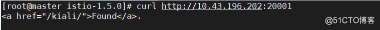
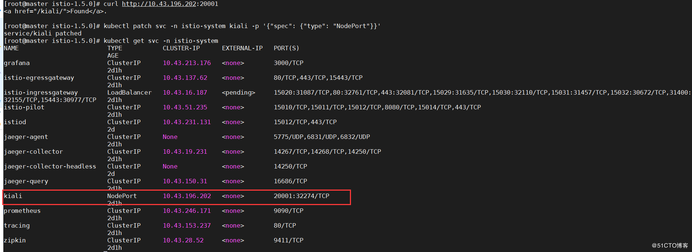
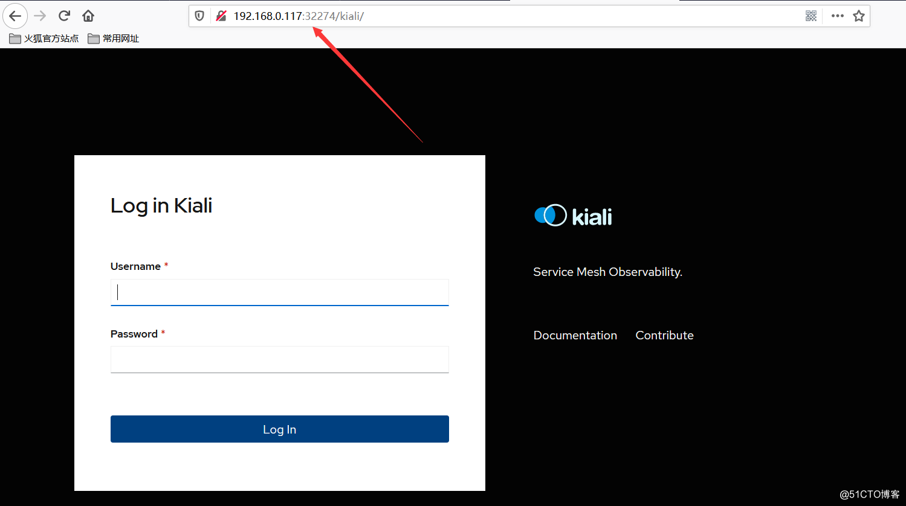
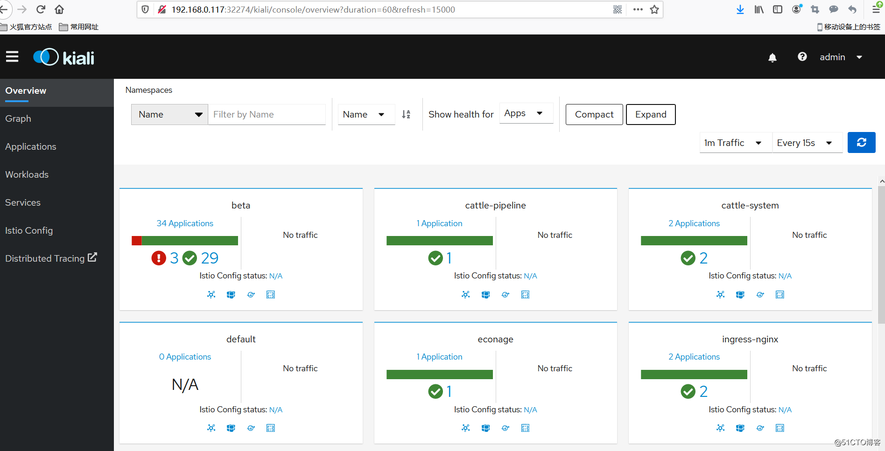
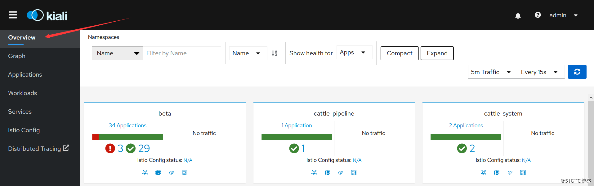
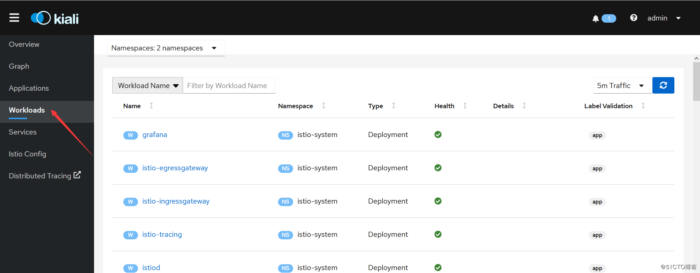
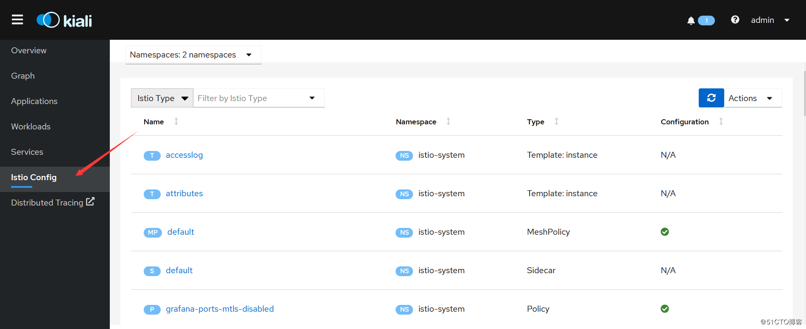
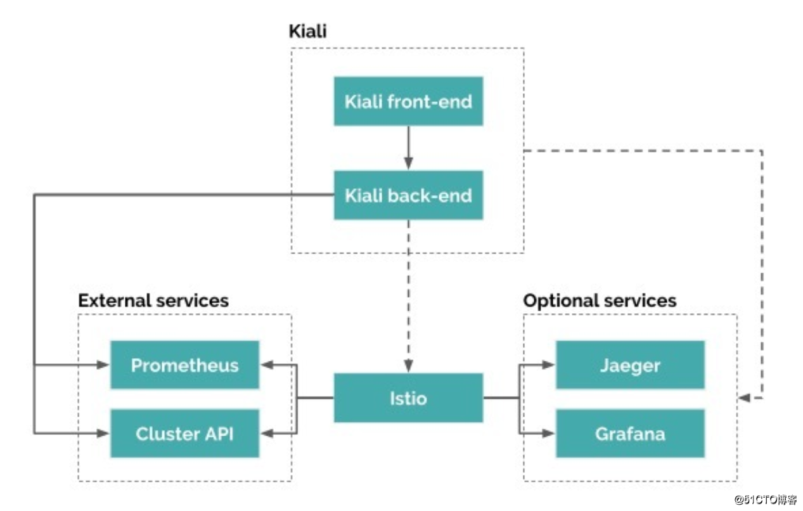
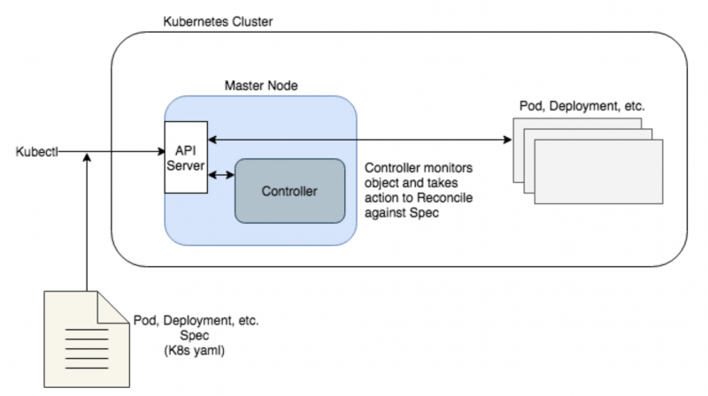
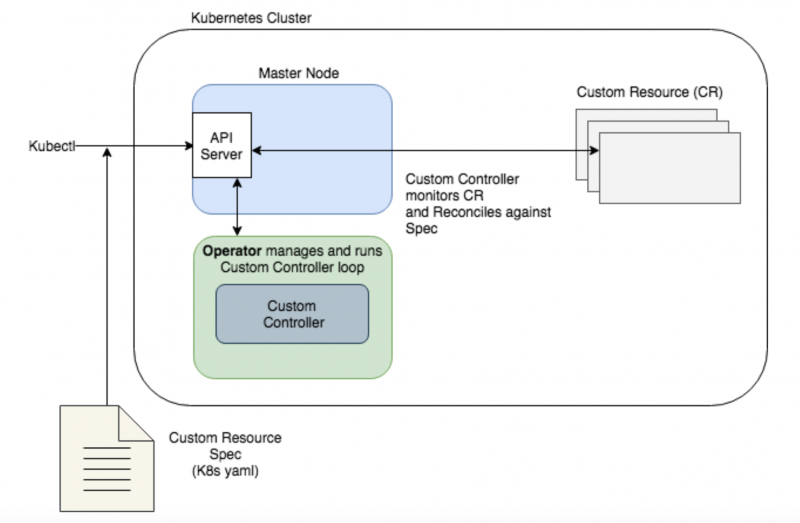

# grafana

## 1.简介

Grafana是一个开源的度量分析与可视化套件。经常被用作基础设施的时间序列数据和应用程序分析的可视化，它在其他领域也被广泛的使用包括工业传感器、家庭自动化、天气和过程控制等。

Grafana支持许多不同的数据源。每个数据源都有一个特定的查询编辑器,该编辑器定制的特性和功能是公开的特定数据来源。

 官方支持以下数据源:Graphite，InfluxDB，OpenTSDB，Prometheus，Elasticsearch，CloudWatch和KairosDB。

每个数据源的查询语言和能力都是不同的。你可以把来自多个数据源的数据组合到一个仪表板，但每一个面板被绑定到一个特定的数据源,它就属于一个特定的组织。

# kiali

## 1.初识kali

### 1.简介

kiali 是一款 istio 服务网格可视化工具，提供了服务拓补图、全链路跟踪、指标遥测、配置校验、健康检查等功能。

> kubectl get all -n istio-system

### 2、kiali访问

在集群内，通过 curl 命令行工具访问 kiali：

> curl http://10.43.196.202:20001

上图所示 kiali 已经部署成功，服务处于就绪状态。下面改成外部浏览器可以直接访问，需要将 service 的服务类型设置为 nodeport，执行命令如下：

> kubectl patch svc -n istio-system kiali -p '{"spec": {"type": "NodePort"}}'

通过浏览器访问

 默认用户名密码是 admin/admin，输入后登录：

### 3、kiali使用

####   3.1  Overview（概观）

该菜单全局性展示所有命名空间下服务的流量（traffic）、配置状态（config status）、健康状态（✔）、应用数量（Applications）等。

#### 3.2 Application（应用维度）

   applications 指运行中的应用，kiali 独有概念。

​	特别注意 kiali 只能识别设置了 app 标签的应用。如果一个应用有多个版本，需要将这几个版本的 app 标签设置为相同的值。

#### 3.3 workloads（负载维度）

​    kiali 中的负载（workloads）跟 k8s 中的资源对应（比如 deployment、Job、Daemonset、Statefulset 等）。k8s 中的这些资源都可以在 kiali 中检测到，不管这些资源有没有加入到 istio 服务网格中。

#### 3.4  Services（服务维度）

对应 k8s 的 service 资源类型。

#### 3.5  Istio Config（配置维度）

 istio 相关配置类信息。比如这里选择 istio type 类型，将显示有关 istio 服务网格下面的各个类型对应的配置信息状态（✔ 表示配置有效；！表示告警），如上图所示。

### 4、kiali 架构

​    由架构图可知，kiali 架构还是比较简单的，属于单体应用。kiali 后台既可以跟外部服务 prometheus、cluster API  进行通信获取 istio 服务网格信息，也可以集成可选服务 jaeger 和 grafana做全链路跟踪和可视化指标度量。

# helm

## 1.helm初识

 Helm 是 Kubernetes 的包管理器，您也可以在 [CNCF Helm 项目过程报告](https://www.cncf.io/cncf-helm-project-journey/)阅读详细的背景信息。

### 1.1使用helm

**三个概念**

- *Chart* 是一个Helm包，涵盖了需要在Kubernetes集群中运行应用，工具或者服务的资源定义。 把它想象成Kubernetes对应的Homebrew公式，Apt dpkg，或者是Yum RPM文件。
- *仓库* 是归集和分享chart的地方。类似于Perl的 [CPAN 归档](https://www.cpan.org/)或者 [Fedora 包数据库](https://fedorahosted.org/pkgdb2/)，只针对于Kubernetes包。
- *发布* 是在Kubernetes集群中运行的chart实例。一个chart经常在同一个集群中被重复安装。每次安装都会生成新的 *发布*。比如MySQL，如果想让两个数据库运行在集群中，可以将chart安装两次。每一个都会有自己的 *发布版本*，并有自己的 *发布名称*

总之：Helm在Kubernetes中安装的每一个 *charts*，都会创建一个新的 *发布*，想查找新chart，可以在Helm chart *仓库* 搜索。

# CRD

全拼CustomResourceDefinitions，也就是自定义K8S资源类型。

内置的资源类型包含POD、Deployment、Configmap等等，我们可以通过CRD机制注册新的资源类型到K8S中。

实际底层就是通过apiserver接口，在etcd中注册一种新的资源类型，此后就可以创建对应的资源对象了，就像我们为不同应用创建不同的Deployment对象一样。

仅仅注册资源与创建资源对象通常是没有价值的，重要的是需要实现CRD背后的功能。比如，Deployment的功能是生成一定数量的POD并监控它们的状态。

所以CRD需要配套实现Controller，相信大家也听过Deployment Controller这些内置的Controller。Controller是需要CRD配套开发的程序，它通过apiserver监听相应类型的资源对象事件，例如：创建、删除、更新等等，然后做出相应的动作，比如Deployment创建/更新时需要对POD进行更新操作等。

# operator

您或许已经听说了自定义Kubernetes Operator，甚至已经阅读了[CoreOS operator-sdk](https://github.com/operator-framework/operator-sdk/blob/master/doc/user-guide.md)，并试着动手设置过。Operator的概念很酷，它可以扩展Kubernetes功能，以更好的管理有状态应用。在[Kenzan](https://kenzan.com/)，我们有幸使用Operator操作那些有状态的基础设施服务，包括：组件升级、节点恢复、调整集群规模。一个理想化的运维平台必须是Operator自己维护有状态应用，并将人工干预降低到最低限度。在读过一些资料后，你可能依然对什么是Operator及其各组件如何协作感到困惑。我们也认为Operator和Operator-sdk的概念有点令人困惑。

在这篇文章中，我们将揭秘什么是Operator，以及如何用CoreOS operator-sdk将输入文件转换为控制Operator运行的代码。在这个循序渐进的教程中，我们将创建一个Operator样例，包括[operator-sdk user guide](https://github.com/operator-framework/operator-sdk/blob/master/doc/user-guide.md)演示的功能和一些高级特性。之后，您将具备为真实应用构建Operator的坚实基础。

### 什么是Operator？

为了理解什么是Operator，让我们先复习一下Kubernetes。Kubernetes实际是期望状态管理器。先在Kubernetes中指定应用程序期望状态（实例数，磁盘空间，镜像等），然后它会尝试把应用维持在这种状态。Kubernetes的控制平面运行在Master节点上，它包含数个controller以调和应用达到期望状态：

- 检查当前的实际状态（Pod、Deployment等）
- 将实际状态与spec期望状态进行比较
- 如果实际状态与期望状态不一致，controller将会尝试协调实际状态以达到一致

比如，通过RS定义Pod拥有3个副本。当其中一个Pod down掉时，Kubernetes controller通过wacth API发现期望运行3个副本，而实际只有2个副本在运行。于是它新创建出一个Pod实例。

如图所示，controller在Kubernetes中发挥的作用。

- 通过Kubectl命令发送对象spec定义（Pod，Deployment等）到Kubernetes Master节点的API服务
- Master节点调度对象运行
- 一旦对象运行，controller会持续检查对象并根据spec协调实际情况

通过这种方式，Kubernetes非常适合维护无状态应用。但它本身的资源类型（Pod，Deployments，Namespaces，Services，DaemonSets等）比较有限。虽然每种资源类型都预定了行为及协调方式，但它们的处理方式没有多大差别。

现在，如果您的应用更复杂并需要执行自定义操作以达到期望的运行状态，应该怎么办？

举一个有状态应用的例子。假如一个数据库应用运行在多个节点上。如果超过半数的节点出现故障，则需要按照特定步骤从特定快照中加载数据。使用原生Kubernetes对象类型和controller则难以实现。或者为有状态应用程序扩展节点，升级到新版本或灾难恢复。这些类型的操作通常需要非常具体的步骤，并且通常需要手动干预。

### 揭晓Operator

Operator通过扩展Kubernetes定义Custom Controller，观察应用并根据实际状态执行自定义任务。应用被定义为Kubernetes对象：[Custom Resource](https://kubernetes.io/docs/concepts/extend-kubernetes/api-extension/custom-resources/) （CR），它包含yaml spec和被API服务接受对象类型（K8s kind）。这样，您可以在自定义规范中定义要观察的任何特定条件，并在实例与规范不匹配时协调实例。虽然Operator controller主要使用自定义组件，但它与原生Kubernetes controller协调方式非常类似。

请注意，两张示意图的主要区别在于，Operator通过Custom Controller协调应用spec。虽然API服务知道Custom Controller，但Operator可以独立运行在集群内部或外部。

*由于Operator是管理有状态应用的强大工具，我们可以找到一些预制Operator来自[CoreOS](http://www.dockone.io/)以及其他贡献者，比如etcd、Vault和Prometheus。这些都是不错的起点，但Operator真正价值来自于你对应用失败状态处理的最佳实践，以及Operator如何协同人工干预。*

### 构建Operator

为了创建自定义Operator，我们需要如下资源：

1. Custom Resource（CR）spec，定义我们要观测的应用对象，以及为CR定义的API
2. Custom Controller，用来观测CR
3. Custom code，决定Custom Controller如何协调CR
4. Operator，管理Custom Controller
5. Deployment，定义Operator和自定义资源

所有上述内容都可以通过手工编写Go代码和spec，或通过[kubebuilder](https://github.com/kubernetes-sigs/kubebuilder)等工具生成Kubernetes API。但最简单的方式（也是我们在这里使用的方法）是使用[CoreOS operator-sdk](https://github.com/operator-framework/operator-sdk/blob/master/doc/user-guide.md)为这些组件生成模版。它允许您通过CLI命令生成spec、controller以及Operator框架。一旦生成后，您可以在spec中定义自定义字段并编写协调的自定义代码。我们将在本教程的下一部分中展开介绍。

# kubebuilder

Kubebuilder是一个使用CRD构建Kubernetes API的框架。

[Kubebuilder](https://link.zhihu.com/?target=https%3A//yq.aliyun.com/go/articleRenderRedirect%3Furl%3Dhttps%3A%2F%2Fgithub.com%2Fkubernetes-sigs%2Fkubebuilder) 是一个使用 CRDs 构建 K8s API 的 SDK，主要是：

- 提供脚手架工具初始化 CRDs 工程，自动生成 boilerplate 代码和配置；
- 提供代码库封装底层的 K8s go-client；

方便用户从零开始开发 CRDs，Controllers 和 Admission Webhooks 来扩展 K8s。

# istio与jaeger

 Jaeger 从  request header 中捕捉上下文(context)。你可能会问，这些 header 是怎么被放到 request 开始部分的？还记得吗，当我说 Istio 用 sidecar 处理服务间的通信，并且应用程序只与它交互。对！你可能已经猜到了。为了让 Istio 跟踪服务之间的 request，当有 request 进入集群时，Istio 的 Ingress Controller 将注入一组 header。然后，它通过 Envoy sidecars 进行传播，并且每个都会将相关的 associated span 上报给 Jaeger。它会让 span 对应到每一个 trace。我们的应用程序代码利用这些 header来收集内部服务之间的 spans。

## 1.1jaejer简介

Uber开发的一个受Dapper和Zipkin启发的分布式跟踪系统.后端用Go实现，前端用React实现。

官方地址https://www.jaegertracing.io/

适用于以下场景:

- 分布式跟踪信息传递
- 分布式事务监控
- 服务依赖性分析
- 展示跨进程调用链
- 定位问题
- 性能优化

### 组件

Jaeger包含以下主要组件：

- 客户端库`jaeger-client-*`：支持多种语言的客户端库，如Go, Java, Python等语言
- 客户端代理`jaeger-agent`：客户端代理负责将追踪数据转发到服务端，这样能方便应用的快速处理，同时减轻服务端的直接压力；另外可以在客户端代理动态调整采样的频率，进行追踪数据采样的控制
- 数据收集器`jaeger-collector`：主要进行数据收集和处理，从客户端代理收集数据进行处理后持久化到数据存储中
- 数据存储：目前Jaeger支持将收集到的数据持久化到`Cassandra`或`Elasticsearch`里面
- 数据查询`jaeger-query`：主要根据不同的条件到数据存储中进行搜索，支撑前端页面的展示
- `jaeger-ui`：是一个基于React的前端应用，作为jaeger的webui
- `jaeger spark`: 是一个基于spark的后处理和聚合数据管道，可以完成jaeger的服务依赖分析

