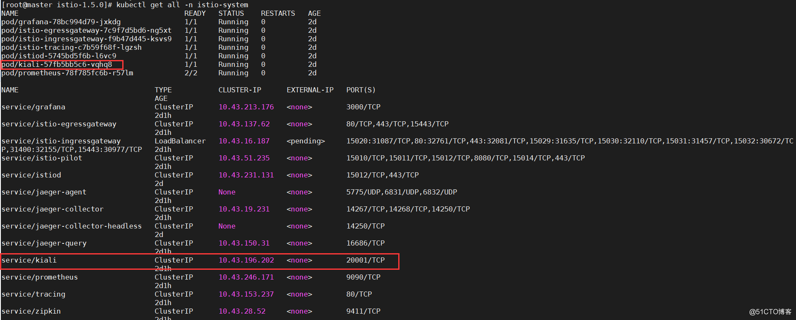
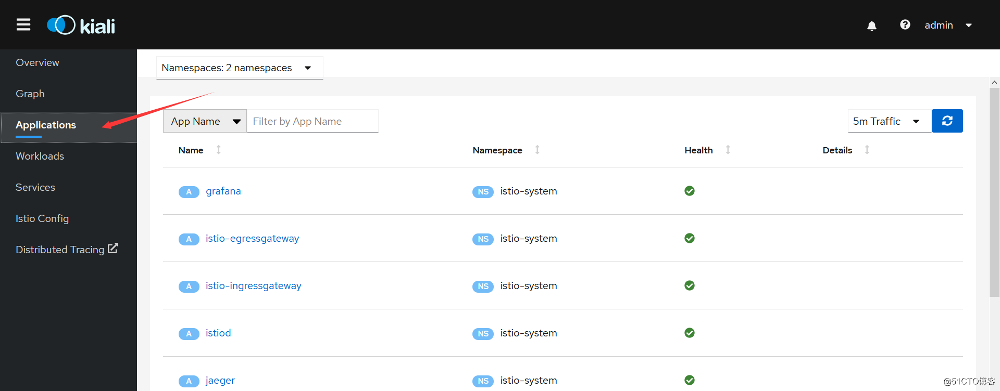
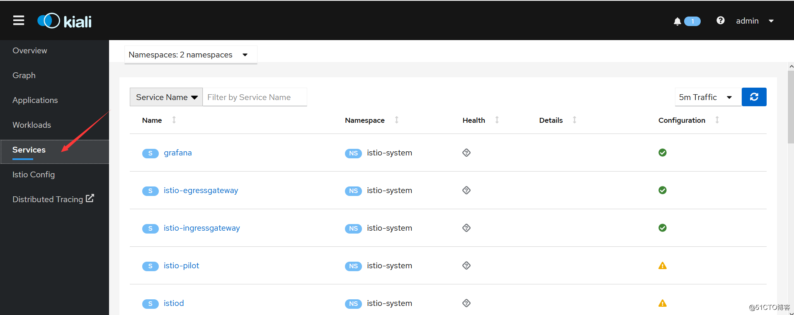

# grafana

## 1.简介

Grafana是一个开源的度量分析与可视化套件。经常被用作基础设施的时间序列数据和应用程序分析的可视化，它在其他领域也被广泛的使用包括工业传感器、家庭自动化、天气和过程控制等。

Grafana支持许多不同的数据源。每个数据源都有一个特定的查询编辑器,该编辑器定制的特性和功能是公开的特定数据来源。

 官方支持以下数据源:Graphite，InfluxDB，OpenTSDB，Prometheus，Elasticsearch，CloudWatch和KairosDB。

每个数据源的查询语言和能力都是不同的。你可以把来自多个数据源的数据组合到一个仪表板，但每一个面板被绑定到一个特定的数据源,它就属于一个特定的组织。


# kiali

## 1.初识kali

### 1.简介

kiali 是一款 istio 服务网格可视化工具，提供了服务拓补图、全链路跟踪、指标遥测、配置校验、健康检查等功能。

> kubectl get all -n istio-system




### 2、kiali访问

在集群内，通过 curl 命令行工具访问 kiali：

> curl http://10.43.196.202:20001


上图所示 kiali 已经部署成功，服务处于就绪状态。下面改成外部浏览器可以直接访问，需要将 service 的服务类型设置为 nodeport，执行命令如下：

> kubectl patch svc -n istio-system kiali -p '{"spec": {"type": "NodePort"}}'


通过浏览器访问


 默认用户名密码是 admin/admin，输入后登录：


### 3、kiali使用

####   3.1  Overview（概观）


该菜单全局性展示所有命名空间下服务的流量（traffic）、配置状态（config status）、健康状态（✔）、应用数量（Applications）等。

#### 3.2 Application（应用维度）

   applications 指运行中的应用，kiali 独有概念。




​	特别注意 kiali 只能识别设置了 app 标签的应用。如果一个应用有多个版本，需要将这几个版本的 app 标签设置为相同的值。

#### 3.3 workloads（负载维度）


​    kiali 中的负载（workloads）跟 k8s 中的资源对应（比如 deployment、Job、Daemonset、Statefulset 等）。k8s 中的这些资源都可以在 kiali 中检测到，不管这些资源有没有加入到 istio 服务网格中。

#### 3.4  Services（服务维度）




对应 k8s 的 service 资源类型。

#### 3.5  Istio Config（配置维度）


 istio 相关配置类信息。比如这里选择 istio type 类型，将显示有关 istio 服务网格下面的各个类型对应的配置信息状态（✔ 表示配置有效；！表示告警），如上图所示。

### 4、kiali 架构


​    由架构图可知，kiali 架构还是比较简单的，属于单体应用。kiali 后台既可以跟外部服务 prometheus、cluster API  进行通信获取 istio 服务网格信息，也可以集成可选服务 jaeger 和 grafana做全链路跟踪和可视化指标度量。


# helm

## 1.helm初识

 Helm 是 Kubernetes 的包管理器，您也可以在 [CNCF Helm 项目过程报告](https://www.cncf.io/cncf-helm-project-journey/)阅读详细的背景信息。

### 1.1使用helm

**三个概念**

- *Chart* 是一个Helm包，涵盖了需要在Kubernetes集群中运行应用，工具或者服务的资源定义。 把它想象成Kubernetes对应的Homebrew公式，Apt dpkg，或者是Yum RPM文件。
- *仓库* 是归集和分享chart的地方。类似于Perl的 [CPAN 归档](https://www.cpan.org/)或者 [Fedora 包数据库](https://fedorahosted.org/pkgdb2/)，只针对于Kubernetes包。
- *发布* 是在Kubernetes集群中运行的chart实例。一个chart经常在同一个集群中被重复安装。每次安装都会生成新的 *发布*。比如MySQL，如果想让两个数据库运行在集群中，可以将chart安装两次。每一个都会有自己的 *发布版本*，并有自己的 *发布名称*

总之：Helm在Kubernetes中安装的每一个 *charts*，都会创建一个新的 *发布*，想查找新chart，可以在Helm chart *仓库* 搜索。


# CRD

全拼CustomResourceDefinitions，也就是自定义K8S资源类型。

内置的资源类型包含POD、Deployment、Configmap等等，我们可以通过CRD机制注册新的资源类型到K8S中。

实际底层就是通过apiserver接口，在etcd中注册一种新的资源类型，此后就可以创建对应的资源对象了，就像我们为不同应用创建不同的Deployment对象一样。

仅仅注册资源与创建资源对象通常是没有价值的，重要的是需要实现CRD背后的功能。比如，Deployment的功能是生成一定数量的POD并监控它们的状态。

所以CRD需要配套实现Controller，相信大家也听过Deployment Controller这些内置的Controller。Controller是需要CRD配套开发的程序，它通过apiserver监听相应类型的资源对象事件，例如：创建、删除、更新等等，然后做出相应的动作，比如Deployment创建/更新时需要对POD进行更新操作等。


# operator

您或许已经听说了自定义Kubernetes Operator，甚至已经阅读了[CoreOS operator-sdk](https://github.com/operator-framework/operator-sdk/blob/master/doc/user-guide.md)，并试着动手设置过。Operator的概念很酷，它可以扩展Kubernetes功能，以更好的管理有状态应用。在[Kenzan](https://kenzan.com/)，我们有幸使用Operator操作那些有状态的基础设施服务，包括：组件升级、节点恢复、调整集群规模。一个理想化的运维平台必须是Operator自己维护有状态应用，并将人工干预降低到最低限度。在读过一些资料后，你可能依然对什么是Operator及其各组件如何协作感到困惑。我们也认为Operator和Operator-sdk的概念有点令人困惑。

在这篇文章中，我们将揭秘什么是Operator，以及如何用CoreOS operator-sdk将输入文件转换为控制Operator运行的代码。在这个循序渐进的教程中，我们将创建一个Operator样例，包括[operator-sdk user guide](https://github.com/operator-framework/operator-sdk/blob/master/doc/user-guide.md)演示的功能和一些高级特性。之后，您将具备为真实应用构建Operator的坚实基础。

### 什么是Operator？

为了理解什么是Operator，让我们先复习一下Kubernetes。Kubernetes实际是期望状态管理器。先在Kubernetes中指定应用程序期望状态（实例数，磁盘空间，镜像等），然后它会尝试把应用维持在这种状态。Kubernetes的控制平面运行在Master节点上，它包含数个controller以调和应用达到期望状态：

- 检查当前的实际状态（Pod、Deployment等）
- 将实际状态与spec期望状态进行比较
- 如果实际状态与期望状态不一致，controller将会尝试协调实际状态以达到一致


比如，通过RS定义Pod拥有3个副本。当其中一个Pod down掉时，Kubernetes controller通过wacth API发现期望运行3个副本，而实际只有2个副本在运行。于是它新创建出一个Pod实例。

如图所示，controller在Kubernetes中发挥的作用。

[](http://dockone.io/uploads/article/20190711/7a58e38f8329ac2a7f044cae176e76ff.png)


- 通过Kubectl命令发送对象spec定义（Pod，Deployment等）到Kubernetes Master节点的API服务
- Master节点调度对象运行
- 一旦对象运行，controller会持续检查对象并根据spec协调实际情况


通过这种方式，Kubernetes非常适合维护无状态应用。但它本身的资源类型（Pod，Deployments，Namespaces，Services，DaemonSets等）比较有限。虽然每种资源类型都预定了行为及协调方式，但它们的处理方式没有多大差别。

现在，如果您的应用更复杂并需要执行自定义操作以达到期望的运行状态，应该怎么办？

举一个有状态应用的例子。假如一个数据库应用运行在多个节点上。如果超过半数的节点出现故障，则需要按照特定步骤从特定快照中加载数据。使用原生Kubernetes对象类型和controller则难以实现。或者为有状态应用程序扩展节点，升级到新版本或灾难恢复。这些类型的操作通常需要非常具体的步骤，并且通常需要手动干预。

### 揭晓Operator

Operator通过扩展Kubernetes定义Custom Controller，观察应用并根据实际状态执行自定义任务。应用被定义为Kubernetes对象：[Custom Resource](https://kubernetes.io/docs/concepts/extend-kubernetes/api-extension/custom-resources/) （CR），它包含yaml spec和被API服务接受对象类型（K8s kind）。这样，您可以在自定义规范中定义要观察的任何特定条件，并在实例与规范不匹配时协调实例。虽然Operator controller主要使用自定义组件，但它与原生Kubernetes controller协调方式非常类似。

[](http://dockone.io/uploads/article/20190711/92b3fd69ea1fa9ba90d7c75044feb5a0.png)


请注意，两张示意图的主要区别在于，Operator通过Custom Controller协调应用spec。虽然API服务知道Custom Controller，但Operator可以独立运行在集群内部或外部。

*由于Operator是管理有状态应用的强大工具，我们可以找到一些预制Operator来自[CoreOS](http://www.dockone.io/)以及其他贡献者，比如etcd、Vault和Prometheus。这些都是不错的起点，但Operator真正价值来自于你对应用失败状态处理的最佳实践，以及Operator如何协同人工干预。*

### 构建Operator

为了创建自定义Operator，我们需要如下资源：

1. Custom Resource（CR）spec，定义我们要观测的应用对象，以及为CR定义的API
2. Custom Controller，用来观测CR
3. Custom code，决定Custom Controller如何协调CR
4. Operator，管理Custom Controller
5. Deployment，定义Operator和自定义资源


所有上述内容都可以通过手工编写Go代码和spec，或通过[kubebuilder](https://github.com/kubernetes-sigs/kubebuilder)等工具生成Kubernetes API。但最简单的方式（也是我们在这里使用的方法）是使用[CoreOS operator-sdk](https://github.com/operator-framework/operator-sdk/blob/master/doc/user-guide.md)为这些组件生成模版。它允许您通过CLI命令生成spec、controller以及Operator框架。一旦生成后，您可以在spec中定义自定义字段并编写协调的自定义代码。我们将在本教程的下一部分中展开介绍。

# kubebuilder

Kubebuilder是一个使用CRD构建Kubernetes API的框架。

[Kubebuilder](https://link.zhihu.com/?target=https%3A//yq.aliyun.com/go/articleRenderRedirect%3Furl%3Dhttps%3A%2F%2Fgithub.com%2Fkubernetes-sigs%2Fkubebuilder) 是一个使用 CRDs 构建 K8s API 的 SDK，主要是：

- 提供脚手架工具初始化 CRDs 工程，自动生成 boilerplate 代码和配置；
- 提供代码库封装底层的 K8s go-client；

方便用户从零开始开发 CRDs，Controllers 和 Admission Webhooks 来扩展 K8s。


# istio

## istio简介

Istio 提供一种简单的方式来为已部署的服务建立网络，该网络具有负载均衡、服务间认证、监控等功能，而不需要对服务的代码做任何改动。

- istio 适用于容器或虚拟机环境（特别是 k8s），兼容异构架构。

- istio 使用 sidecar（边车模式）代理服务的网络，不需要对业务代码本身做任何的改动。

- HTTP、gRPC、WebSocket 和 TCP 流量的自动负载均衡。

- istio 通过丰富的路由规则、重试、故障转移和故障注入，可以对流量行为进行细粒度控制；支持访问控制、速率限制和配额。

- istio 对出入集群入口和出口中所有流量的自动度量指标、日志记录和跟踪。
- 在具有强大的基于身份验证和授权的集群中实现安全的服务间通信。

## 1.1核心特性

istio以统一的方式提供了许多跨服务网络的关键功能：

### 1.流量管理

​	Istio 简单的规则配置和流量路由允许您控制服务之间的流量和 API 调用过程。

​	Istio 简化了服务级属性（如熔断器、超时和重试）的配置，并且让它轻而易举的执行重要的任务（如 A/B 测试、金丝雀发布和按流量百分比划分的分阶段发布）。

### 2.安全

Istio 提供了底层的安全通信通道，并为大规模的服务通信管理认证、授权和加密。

开发人员只需要关注程序的安全性

### 3.可观察性

Istio 健壮的追踪、监控和日志特性让您能够深入的了解服务网格部署。

通过 Istio 的监控能力，可以真正的了解到服务的性能是如何影响上游和下游的；

定制 Dashboard 提供了对所有服务性能的可视化能力

Istio 的 Mixer 组件负责策略控制和遥测数据收集。它提供了后端抽象和中介，将一部分 Istio 与后端的基础设施实现细节隔离开来，并为运维人员提供了对网格与后端基础实施之间交互的细粒度控制。

### 4.平台支持

独立于平台，被设计为可以在各种环境中运行，包括跨云、内部环境、Kubernetes、Mesos 等等。您可以在 Kubernetes 或是装有 Consul 的 Nomad 环境上部署 Istio。

目前支持：

- Kubernetes 上的服务部署
- 基于 Consul 的服务注册
- 服务运行在独立的虚拟机上

### 5.整合和定制

Istio 的策略实施组件可以扩展和定制，与现有的 ACL、日志、监控、配额、审查等解决方案集成。

## 1.2istio组件

stio由以下组件组成：

- **Envoy** - 每微服务器的Sidecar代理，处理集群中的服务间和服务到外部服务的入口/出口流量。代理形成安全的微服务网格，提供丰富的功能，如服务发现，丰富的7层路由，熔断器，策略执行和遥测记录/报告功能。

> 注意：服务网格不是overlay网络。它简化和增强了应用程序中的微服务通过底层平台提供的网络彼此通话的方式。

- **Mixer** - 由代理和微服务使用的集中式组件，用于执行策略，如鉴权，限流，配额，认证，请求跟踪和遥测收集等。
- **Pilot** - 负责在运行时配置代理的组件。
- **Citadel** - 负责证书颁发和轮换的集中式组件
- **Node Agent** - 负责证书颁发和轮换的每节点组件
- **Galley** - 用于在Istio中验证，摄取，聚合，转换和分发配置的中央组件。

Istio目前只支持Kubernetes平台和基于consul的环境，我们计划在不久的将来支持其他平台，如Cloud Foundry和Mesos。


### Envoy

Istio 使用 [Envoy](https://envoyproxy.github.io/envoy/) 代理的扩展版本。Envoy 是用 C++ 开发的高性能代理，用于协调服务网格中所有服务的入站和出站流量。Envoy 代理是唯一与数据平面流量交互的 Istio 组件。

Envoy 代理被部署为服务的 sidecar，在逻辑上为服务增加了 Envoy 的许多内置特性，例如:

- 动态服务发现
- 负载均衡
- TLS 终端
- HTTP/2 与 gRPC 代理
- 熔断器
- 健康检查
- 基于百分比流量分割的分阶段发布
- 故障注入
- 丰富的指标

这种 sidecar 部署允许 Istio 提取大量关于流量行为的信号作为[属性](https://istio.io/latest/zh/docs/reference/config/policy-and-telemetry/mixer-overview/#attributes)。Istio 可以使用这些属性来实施策略决策，并将其发送到监视系统以提供有关整个网格行为的信息。

sidecar 代理模型还允许您向现有的部署添加 Istio 功能，而不需要重新设计架构或重写代码。您可以在[设计目标](https://istio.io/latest/zh/docs/ops/deployment/architecture/#design-goals)中读到更多关于为什么我们选择这种方法的信息。

由 Envoy 代理启用的一些 Istio 的功能和任务包括:

- 流量控制功能：通过丰富的 HTTP、gRPC、WebSocket 和 TCP 流量路由规则来执行细粒度的流量控制。
- 网络弹性特性：重试设置、故障转移、熔断器和故障注入。
- 安全性和身份验证特性：执行安全性策略以及通过配置 API 定义的访问控制和速率限制。
- 基于 WebAssembly 的可插拔扩展模型，允许通过自定义策略实施和生成网格流量的遥测。

### Pilot

Pilot 为 Envoy sidecar 提供服务发现、用于智能路由的流量管理功能（例如，A/B 测试、金丝雀发布等）以及弹性功能（超时、重试、熔断器等）。

Pilot 将控制流量行为的高级路由规则转换为特定于环境的配置，并在运行时将它们传播到 sidecar。Pilot 将特定于平台的服务发现机制抽象出来，并将它们合成为任何符合 [Envoy API](https://www.envoyproxy.io/docs/envoy/latest/api/api) 的 sidecar 都可以使用的标准格式。

下图展示了平台适配器和 Envoy 代理如何交互。

[](https://istio.io/latest/zh/docs/ops/deployment/architecture/discovery.svg)

Service discovery

1. 平台启动一个服务的新实例，该实例通知其平台适配器。
2. 平台适配器使用 Pilot 抽象模型注册实例。
3. **Pilot** 将流量规则和配置派发给 Envoy 代理，来传达此次更改。

这种松耦合允许 Istio 在 Kubernetes、Consul 或 Nomad 等多种环境中运行，同时维护相同的 operator 接口来进行流量管理。

您可以使用 Istio 的[流量管理 API](https://istio.io/latest/zh/docs/concepts/traffic-management/#introducing-Istio-traffic-management) 来指示 Pilot 优化 Envoy 配置，以便对服务网格中的流量进行更细粒度地控制。

### Citadel

[Citadel](https://istio.io/latest/zh/docs/concepts/security/) 通过内置的身份和证书管理，可以支持强大的服务到服务以及最终用户的身份验证。您可以使用 Citadel 来升级服务网格中的未加密流量。使用 Citadel，operator 可以执行基于服务身份的策略，而不是相对不稳定的 3 层或 4 层网络标识。从 0.5 版开始，您可以使用 [Istio 的授权特性](https://istio.io/latest/zh/docs/concepts/security/#authorization)来控制谁可以访问您的服务。

### Galley

Galley 是 Istio 的配置验证、提取、处理和分发组件。它负责将其余的 Istio 组件与从底层平台（例如 Kubernetes）获取用户配置的细节隔离开来。

## 1.3资源CRD 

### **Istio Network CRD**

networking.istio.io

| CRD               | 描述                                                         |
| :---------------- | :----------------------------------------------------------- |
| VirtualService    | VirtualService 定义了一系列针对指定服务的流量路由规则。每个路由规则都针对特定协议的匹配规则。如果流量符合这些特征，就会根据规则发送到服务注册表中的目标服务（或者目标服务的子集或版本）。 |
| DestinationRule   | `DestinationRule` 所定义的策略，决定了经过路由处理之后的流量的访问策略。这些策略中可以定义负载均衡配置、连接池尺寸以及外部检测（用于在负载均衡池中对不健康主机进行识别和驱逐）配置。 |
| Gateway           | `Gateway` 描述了一个负载均衡器，用于承载网格边缘的进入和发出连接。这一规范中描述了一系列开放端口，以及这些端口所使用的协议、负载均衡的 SNI 配置等内容。 |
| ServiceEntry      | `ServiceEntry` 能够在 Istio 内部的服务注册表中加入额外的条目，从而让网格中自动发现的服务能够访问和路由到这些手工加入的服务。 |
| EnvoyFilter       | EnvoyFilter 对象描述了针对代理服务的过滤器，这些过滤器可以定制由 Istio Pilot 生成的代理配置。 |
| ServiceDependency | `ServiceDependency`描述工作负载依赖的服务集合。默认情况下，Istio建立的服务网格将具有完整的网格连接 - 即每个工作负载都拥有访问网格中的每个其他工作负载的代理配置。但是，大多数连接图在实践中都很稀疏。ServiceDependency提供了一种的方法来声明与每个工作负载关联的服务依赖关系，以便发送到sidecars的配置数量可以限定为必要的依赖。 |


### Istio Authentication CRD

authentication.istio.io

相关资料：

- 官方资料的配置参考： https://preliminary.istio.io/docs/reference/config/istio.authentication.v1alpha1/#Policy
- 代码在 `istio/api` 仓库下的 `authentication/v1alpha1` 目录

#### Policy

策略定义在工作负载上可以接受的身份验证方法，如果验证通过，哪个方法/证书将设置为请求主体(request principal)（即 `request.auth.principal` 属性）。

验证策略由两部分验证组成：

- peer：验证调用者服务证书。这部分将设置 `source.user`（peer identity）。
- origin：验证原始证书。此部分将设置 `request.auth.user`（origin identity），以及`request.auth.presenter`，`request.auth.audiences`和 raw claim 等其他属性。

请注意，身份可以是最终用户(end-user)，服务帐户(service account)，设备(device)等。

最后但并非最不重要的是，主要绑定规则(principal binding rule)定义应将哪个身份（peer 或者 origin）用作主体。默认情况下，使用peer。

#### Mesh Policy

TBD：没有找到介绍资料

`pilot/pkg/config/kube/crd/types.go` 中定义如下：

```go
// MeshPolicy is the generic Kubernetes API object wrapper
type MeshPolicy struct {
	meta_v1.TypeMeta   `json:",inline"`
	meta_v1.ObjectMeta `json:"metadata"`
	Spec               map[string]interface{} `json:"spec"`
}
```

`install/kubernetes/helm/istio/templates/crds.yaml`:

```yam
kind: CustomResourceDefinition
apiVersion: apiextensions.k8s.io/v1beta1
metadata:
  name: meshpolicies.authentication.istio.io
  annotations:
    "helm.sh/hook": crd-install
  labels:
    app: istio-citadel
    chart: istio
    heritage: Tiller
    release: istio
spec:
  group: authentication.istio.io
  names:
    kind: MeshPolicy
    listKind: MeshPolicyList
    plural: meshpolicies
    singular: meshpolicy
    categories:
    - istio-io
    - authentication-istio-io
  scope: Cluster
  version: v1alpha1
```

[
  ](https://skyao.io/learning-istio/crd/network/sidecar.html)


# istio与jaeger

 Jaeger 从  request header 中捕捉上下文(context)。你可能会问，这些 header 是怎么被放到 request 开始部分的？还记得吗，当我说 Istio 用 sidecar 处理服务间的通信，并且应用程序只与它交互。对！你可能已经猜到了。为了让 Istio 跟踪服务之间的 request，当有 request 进入集群时，Istio 的 Ingress Controller 将注入一组 header。然后，它通过 Envoy sidecars 进行传播，并且每个都会将相关的 associated span 上报给 Jaeger。它会让 span 对应到每一个 trace。我们的应用程序代码利用这些 header来收集内部服务之间的 spans。

## 1.1jaejer简介

Uber开发的一个受Dapper和Zipkin启发的分布式跟踪系统.后端用Go实现，前端用React实现。

官方地址https://www.jaegertracing.io/

适用于以下场景:

- 分布式跟踪信息传递
- 分布式事务监控
- 服务依赖性分析
- 展示跨进程调用链
- 定位问题
- 性能优化

### 组件


Jaeger包含以下主要组件：

- 客户端库`jaeger-client-*`：支持多种语言的客户端库，如Go, Java, Python等语言
- 客户端代理`jaeger-agent`：客户端代理负责将追踪数据转发到服务端，这样能方便应用的快速处理，同时减轻服务端的直接压力；另外可以在客户端代理动态调整采样的频率，进行追踪数据采样的控制
- 数据收集器`jaeger-collector`：主要进行数据收集和处理，从客户端代理收集数据进行处理后持久化到数据存储中
- 数据存储：目前Jaeger支持将收集到的数据持久化到`Cassandra`或`Elasticsearch`里面
- 数据查询`jaeger-query`：主要根据不同的条件到数据存储中进行搜索，支撑前端页面的展示
- `jaeger-ui`：是一个基于React的前端应用，作为jaeger的webui
- `jaeger spark`: 是一个基于spark的后处理和聚合数据管道，可以完成jaeger的服务依赖分析


# Prometheus

## 简介

Prometheus 是一个开源的服务监控系统和时间序列数据库。

```
Prometheus是一套开源的监控&报警&时间序列数据库的组合,起始是由SoundCloud公司开发的。成立于2012年，之后许多公司和组织接受和采用prometheus,他们便将它独立成开源项目，并且有公司来运作.该项目有非常活跃的社区和开发人员，目前是独立的开源项目，任何公司都可以使用它，2016年，Prometheus加入了云计算基金会，成为kubernetes之后的第二个托管项目.google SRE的书内也曾提到跟他们BorgMon监控系统相似的实现是Prometheus。现在最常见的Kubernetes容器管理系统中，通常会搭配Prometheus进行监控。
```


官网：https://prometheus.io/


特性：

- 高维度数据模型
- 自定义查询语言
- 可视化数据展示
- 高效的存储策略
- 易于运维
- 提供各种客户端开发库
- 警告和报警
- 数据导出

## Prometheus的数据类型

Prometheus 的四种数据类型分别是：Counter、Gauge、Histogram和Summary。这里分别做下介绍。

### Counter 

Counter数据类型的特点：

- Counter 用于累计值，例如 记录 请求次数、任务完成数、错误发生次数。
- 一直增加，不会减少。
- 重启进程后，会被重置。

```bsh
例如：http_response_total{method="GET",endpoint="/api/tracks"} 10010秒后抓取 http_response_total{method="GET",endpoint="/api/tracks"} 100
```

### Gauge 

Gauge数据类型的特点：

- Gauge 常规数值，例如 温度变化、内存使用变化。
- 可变大，可变小。
- 重启进程后，会被重置

```bsh
例如： memory_usage_bytes{host="master-01"} 100 < 抓取值memory_usage_bytes{host="master-01"} 30memory_usage_bytes{host="master-01"} 50memory_usage_bytes{host="master-01"} 80 < 抓取值
```

### Histogram 

Histogram 可以理解为柱状图的意思，常用于跟踪事件发生的规模，例如：请求耗时、响应大小。它特别之处是可以对记录的内容进行分组，提供 count 和 sum 全部值的功能。例如：{小于10=5次，小于20=1次，小于30=2次}，count=8次，sum=8次的求和值


### Summary 

Summary和Histogram十分相似，常用于跟踪事件发生的规模，例如：请求耗时、响应大小。同样提供 count 和 sum 全部值的功能。
例如：count=7次，sum=7次的值求值
它提供一个quantiles的功能，可以按%比划分跟踪的结果。例如：quantile取值0.95，表示取采样值里面的95%数据。


### summary和histogram的选择 


- Summary 结构有频繁的全局锁操作，对高并发程序性能存在一定影响。histogram仅仅是给每个桶做一个原子变量的计数就可以了，而summary要每次执行算法计算出最新的X分位value是多少，算法需要并发保护。会占用客户端的cpu和内存。
- 不能对Summary产生的quantile值进行aggregation运算（例如sum, avg等）。例如有两个实例同时运行，都对外提供服务，分别统计各自的响应时间。最后分别计算出的0.5-quantile的值为60和80，这时如果简单的求平均(60+80)/2，认为是总体的0.5-quantile值，那么就错了。
- summary的百分位是提前在客户端里指定的，在服务端观测指标数据时不能获取未指定的分为数。而histogram则可以通过promql随便指定，虽然计算的不如summary准确，但带来了灵活性。
- histogram不能得到精确的分为数，设置的bucket不合理的话，误差会非常大。会消耗服务端的计算资源。

所以对比得到的总结是：

1. 如果需要聚合（aggregate），选择histograms。
2. 如果比较清楚要观测的指标的范围和分布情况，选择histograms。如果需要精确的分为数选择summary。