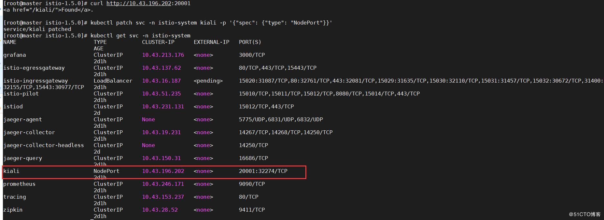

# kiali

## 1.初识kali

### 1.简介

kiali 是一款 istio 服务网格可视化工具，提供了服务拓补图、全链路跟踪、指标遥测、配置校验、健康检查等功能。

> kubectl get all -n istio-system

### 2、kiali访问

在集群内，通过 curl 命令行工具访问 kiali：

> curl http://10.43.196.202:20001

上图所示 kiali 已经部署成功，服务处于就绪状态。下面改成外部浏览器可以直接访问，需要将 service 的服务类型设置为 nodeport，执行命令如下：

> kubectl patch svc -n istio-system kiali -p '{"spec": {"type": "NodePort"}}'

通过浏览器访问

 默认用户名密码是 admin/admin，输入后登录：

### 3、kiali使用

####   3.1  Overview（概观）

该菜单全局性展示所有命名空间下服务的流量（traffic）、配置状态（config status）、健康状态（✔）、应用数量（Applications）等。

#### 3.2 Application（应用维度）

   applications 指运行中的应用，kiali 独有概念。

​	特别注意 kiali 只能识别设置了 app 标签的应用。如果一个应用有多个版本，需要将这几个版本的 app 标签设置为相同的值。

#### 3.3 workloads（负载维度）

​    kiali 中的负载（workloads）跟 k8s 中的资源对应（比如 deployment、Job、Daemonset、Statefulset 等）。k8s 中的这些资源都可以在 kiali 中检测到，不管这些资源有没有加入到 istio 服务网格中。

#### 3.4  Services（服务维度）

对应 k8s 的 service 资源类型。

#### 3.5  Istio Config（配置维度）

 istio 相关配置类信息。比如这里选择 istio type 类型，将显示有关 istio 服务网格下面的各个类型对应的配置信息状态（✔ 表示配置有效；！表示告警），如上图所示。

### 4、kiali 架构

​    由架构图可知，kiali 架构还是比较简单的，属于单体应用。kiali 后台既可以跟外部服务 prometheus、cluster API  进行通信获取 istio 服务网格信息，也可以集成可选服务 jaeger 和 grafana做全链路跟踪和可视化指标度量。