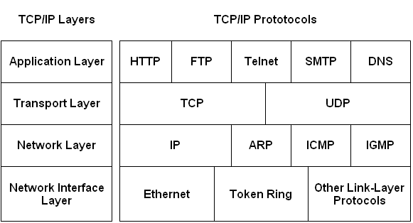

# 微服务协议

## 互联网协议

## 协议分类

### 1、按照它所针对的语义可以分为

面向资源：比如 REST， 主要是对于资源的存取和修改

面向命令：比如SOAP, RMI，RPC ， 主要是指对于方法， 命令及过程的远程调用

面向事件：比如 XMPP， JMS，AMQP， 主要是对于消息的传递和转发

### 2、按照远程调用协议的编码可以分为

文本协议：例如 HTTP + JSON/XML， SIP

二进制协议：例如 WebSocket + BSon/Protobuf

 

### 3、按照协议的用途可以分为

信令及控制协议：例如 SIP, SDP, Jingle, ROAP

媒体传输协议：例如 HTTP, RTP, RTMP

安全相关协议：例如 TLS, DTLS, oAuth2

###  4、按数据传输格式分类

任何一个服务会使用一个协议栈, 从下到上采用相应的协议, 上层服务应用协议所使用的数据传输格式很多，但无非表示为文本和二进制格式

HTTP 是互联网的最主要的协议, 也是微服务中最流行的协议， 在它之上, 又有 RPC (Remote Procedure Call 远程过程调用) 和 REST (Representational state transfer 表述性状态转移) 两种风格.

前者多使用 HTTP + XML(SOAP), 后者多使用 HTTP + JSON(REST)

WebSocket + Protobuf 也是一个比较流行的做法, 发挥了长连接双向通讯的优势, 并且编解码速度比较快

#### （1）文本格式

常用的有：键值对；Json；Xml

#### （2）二进制格式

常用的有：Proto buffer；BSON；Thrift；PDU

基于 TCP 的流式传输, 在数据包之间必需有易于识别的分隔符, 文本格式中用得最多的就是 \r\n, 或者类似于 xml/json 之类的 tag, 成对的 {} 或 []. 二进制格式中一般会在包头指定长度, 以便分割,

例如 SMTP 和 HTTP 协议,