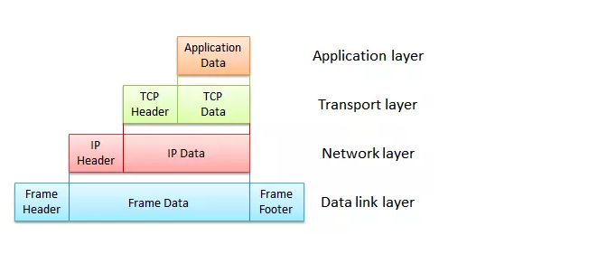

# 负载均衡

## L3/4负载

另一种较为常见的负载平衡则是L3/4负载平衡。这里的L3/4实际上指的就是负载平衡服务器会根据OSI模型中的第三层网络层（Network Layer）和第四层传输层（Transport Layer）所包含的数据来进行负载平衡操作。在这种负载平衡服务器中，这些数据主要包含数据包的IP头和TCP、UDP等协议的协议头：

L3/4负载平衡服务器的工作原理非常简单：在数据到达时，负载平衡服务器将根据自身算法以及OSI模型三四层所包含的数据决定需要处理该数据的服务实例并将其转发。
　　
整个负载平衡的运行包含三方面内容：负载平衡服务器需要知道当前有效的服务实例到底有哪些，并根据自身的分派算法来决定需要处理数据的服务实例，根据分派算法的计算结果将数据发送到目标服务实例上。