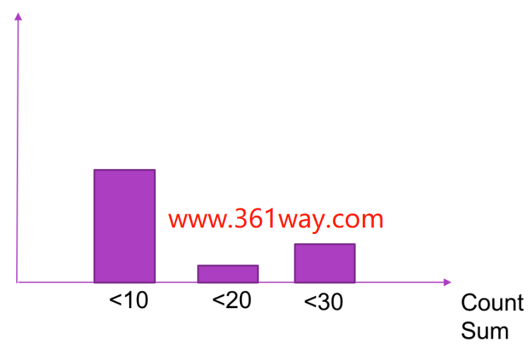

# Prometheus

## 简介

Prometheus 是一个开源的服务监控系统和时间序列数据库。

```
Prometheus是一套开源的监控&报警&时间序列数据库的组合,起始是由SoundCloud公司开发的。成立于2012年，之后许多公司和组织接受和采用prometheus,他们便将它独立成开源项目，并且有公司来运作.该项目有非常活跃的社区和开发人员，目前是独立的开源项目，任何公司都可以使用它，2016年，Prometheus加入了云计算基金会，成为kubernetes之后的第二个托管项目.google SRE的书内也曾提到跟他们BorgMon监控系统相似的实现是Prometheus。现在最常见的Kubernetes容器管理系统中，通常会搭配Prometheus进行监控。
```


官网：https://prometheus.io/


特性：

- 高维度数据模型
- 自定义查询语言
- 可视化数据展示
- 高效的存储策略
- 易于运维
- 提供各种客户端开发库
- 警告和报警
- 数据导出

## Prometheus的数据类型

Prometheus 的四种数据类型分别是：Counter、Gauge、Histogram和Summary。这里分别做下介绍。

### Counter 

Counter数据类型的特点：

- Counter 用于累计值，例如 记录 请求次数、任务完成数、错误发生次数。
- 一直增加，不会减少。
- 重启进程后，会被重置。

```bsh
例如：http_response_total{method="GET",endpoint="/api/tracks"} 10010秒后抓取 http_response_total{method="GET",endpoint="/api/tracks"} 100
```

### Gauge 

Gauge数据类型的特点：

- Gauge 常规数值，例如 温度变化、内存使用变化。
- 可变大，可变小。
- 重启进程后，会被重置

```bsh
例如： memory_usage_bytes{host="master-01"} 100 < 抓取值memory_usage_bytes{host="master-01"} 30memory_usage_bytes{host="master-01"} 50memory_usage_bytes{host="master-01"} 80 < 抓取值
```

### Histogram 

Histogram 可以理解为柱状图的意思，常用于跟踪事件发生的规模，例如：请求耗时、响应大小。它特别之处是可以对记录的内容进行分组，提供 count 和 sum 全部值的功能。例如：{小于10=5次，小于20=1次，小于30=2次}，count=8次，sum=8次的求和值




### Summary 

Summary和Histogram十分相似，常用于跟踪事件发生的规模，例如：请求耗时、响应大小。同样提供 count 和 sum 全部值的功能。
例如：count=7次，sum=7次的值求值
它提供一个quantiles的功能，可以按%比划分跟踪的结果。例如：quantile取值0.95，表示取采样值里面的95%数据。


### summary和histogram的选择 


- Summary 结构有频繁的全局锁操作，对高并发程序性能存在一定影响。histogram仅仅是给每个桶做一个原子变量的计数就可以了，而summary要每次执行算法计算出最新的X分位value是多少，算法需要并发保护。会占用客户端的cpu和内存。
- 不能对Summary产生的quantile值进行aggregation运算（例如sum, avg等）。例如有两个实例同时运行，都对外提供服务，分别统计各自的响应时间。最后分别计算出的0.5-quantile的值为60和80，这时如果简单的求平均(60+80)/2，认为是总体的0.5-quantile值，那么就错了。
- summary的百分位是提前在客户端里指定的，在服务端观测指标数据时不能获取未指定的分为数。而histogram则可以通过promql随便指定，虽然计算的不如summary准确，但带来了灵活性。
- histogram不能得到精确的分为数，设置的bucket不合理的话，误差会非常大。会消耗服务端的计算资源。

所以对比得到的总结是：

1. 如果需要聚合（aggregate），选择histograms。
2. 如果比较清楚要观测的指标的范围和分布情况，选择histograms。如果需要精确的分为数选择summary。